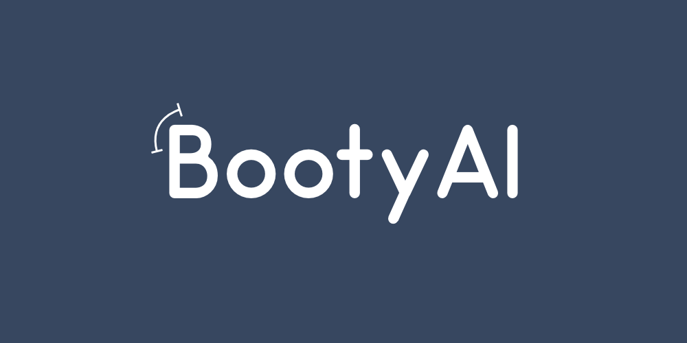
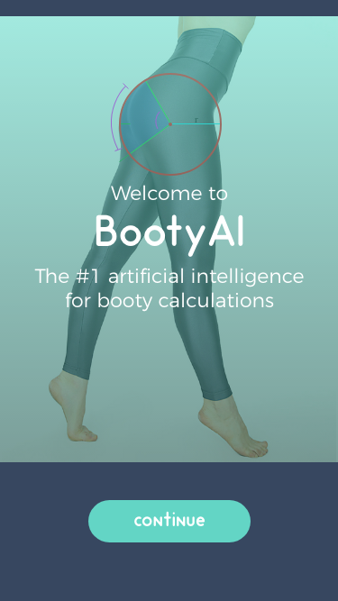
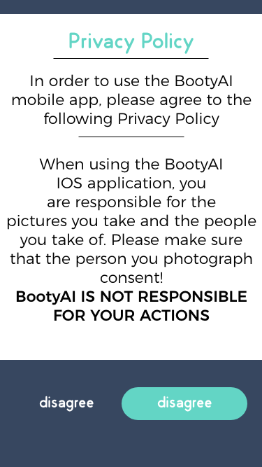
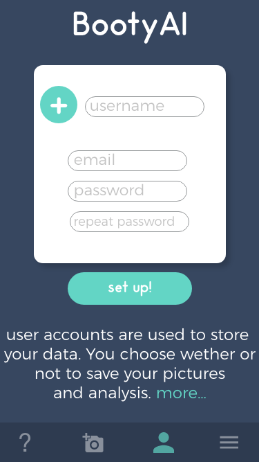

# BootyAI

A computer vision and artificial intelligence app for calculating booties. Currently in development. Coming to the Apple App Store soon.

## Quick Links

- Introduction
- Documentation
- Join Beta Test!
- Development
  - Code Explanation
  - Algorithm Designs
  - Frameworks
  - Illustrations
 - How To Contribute

## Introduction

Ever wondered what the mathematical representation and the calculations of a nice butt is? Probably not, but regardless of whether you care about math or not, the BootyAI IOS application is extremely entertaining. The mathematics might not be as relevant to everyone, so we trained an AI to produce a score out of 10, and a cool comment about the photo.

## Documentation

Below you will find screenshots of mockups, design ideas, etc., and we will update them during development.

#### The Welcome Screen

#### The Privacy Policy Screen

#### The Sign Up and Log In Screens

more

## Join The Open Beta!

## Development

#### Code Explanation

#### Algorithm Designs

#### Frameworks

##### The BootyNet Model

BootyNet is a custom CoreML model used for Machine Learning and Computer Vision. It is trained to recognize 1000+ booty types of all forms and sizes.

https://developer.apple.com/machine-learning/

